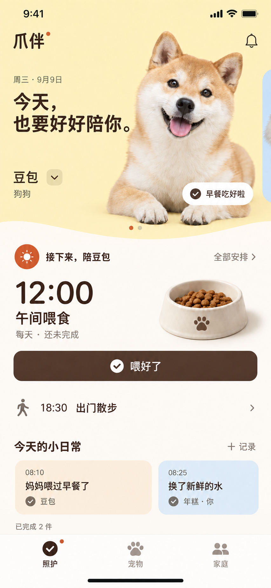

# 爪伴移动端设计规范

状态：2026-09-09 确认的视觉方向，作为后续页面设计与 Flutter 实现的参考。当前仅固化设计，不代表客户端已实现。设计稿中的照片、名字、时间与操作记录均为示例。

## 核心方向：温暖的宠物生活空间

干净、温馨、有陪伴感，同时允许有辨识度的布局和自定义组件。情感中心是宠物，操作中心是当下需要完成的照护。通过真实宠物照片、自然文案和家人的参与表达温度。

首页采用「宠物场景 → 下一件照护 → 家庭日常」的信息结构。其他页面延续配色、文字层级和交互语言，不必复制首页的大幅照片与曲面构图。设置、表单和密集记录页保持常规、高效。

## 视觉参考

参考图定义视觉方向，不作为逐像素尺寸或业务契约。主操作按钮与下一项预览之间不使用横向分割线，以连续暖白底和留白自然衔接。顶部浅曲面保留，用于连接宠物场景与照护内容，不扩散成每个区域的装饰。

## 色彩与材质

以下为实现起点，不是从生成图精确取样的色值；应在实际设备和文字对比检查中微调。

| 语义 | 建议色值 | 使用方式 |
| --- | --- | --- |
| 页面底色 | `#FAF8F4` | 连续暖白内容面 |
| 宠物场景 | `#FFF0B8` | 首页奶油黄情感区域 |
| 主文字 | `#38291F` | 标题、主要信息 |
| 主操作 | `#573E2F` | 当前照护完成按钮 |
| 次级文字 | `#786C61` | 时间说明、辅助信息，仍须清晰可读 |
| 少量强调 | `#CC592D` | 选中状态与小范围强调 |
| 日常底色 | `#FAECD9` / `#DDEAF6` | 浅杏、浅蓝记录块 |

界面色块以纯色为主。摄影允许自然光影，不将图片的明暗变化转成装饰性渐变。避免厚边框、强阴影、大量色块和层层卡片。状态必须同时通过文字或图标表达，不能只靠颜色。

## 首页组件

### 宠物场景

- 宠物照片自然融入场景，可采用透明背景主体；文字与主体分区，不能遮挡眼睛或主要操作。
- 左右滑动切换宠物，名字旁保留明确的选择入口；不自动轮播，不要求用户发现隐藏手势。
- 小型状态标签只能来自真实照护记录，不能凭空显示「早餐吃好啦」。
- 无照片时使用常规宠物图标与名字，不依赖抠图能力才能使用页面。宠物较多时提供选择列表。

### 下一件照护

- 同一区域突出时间、事项和一个明确完成操作，例如「喂好了」；任意自定义事项使用「完成照护」，不猜测其类型。
- 先处理逾期事项，再展示最近待办；同时提供全部安排入口。不得因展示单只宠物而静默隐藏其他宠物的逾期事项，应提供家庭范围的提示入口。
- 下一项采用紧凑预览行，以留白和文字层级衔接；主按钮下方不加横线。
- 配图只辅助理解；没有对应素材时省略，不为每个事项强行加入图片。

### 家庭日常

- 用轻量、可横向浏览的记录块呈现谁、何时、为哪只宠物完成了什么；文本长度变化时允许换行或进入详情。
- 「已完成」数量明确统计范围，不把家庭数与当前宠物数混用。
- 图中的「＋记录」是待规划入口，当前自由记录能力未实现时不展示空操作入口。已有完成历史可以复用。

## 排版与交互

- 使用清晰的系统中文字体与匹配的英文回退；按信息层级安排字重，避免所有标题都加粗放大。
- 尺寸随屏宽、内容和字体缩放调整，不将效果图像素直接换成 Flutter 逻辑像素。小屏优先压缩照片区域，保证主要操作可达；内容允许纵向滚动。
- 按钮视觉可克制，但保留平台建议的触控区域。底部保留「照护／宠物／家庭」，使用成熟图标库的常规符号。
- 完成请求中防重复点击；服务端成功后显示完成状态、操作者并提供撤销，失败时保留事项和明确反馈。后续事项平稳替换，避免列表突然跳动。
- 动效短而轻，支持系统减少动态效果；不强制等待庆祝动画，不自动翻页。
- 提醒、添加、设置等辅助入口不得抢占主任务的视觉焦点。
- 空状态给出明确下一步；同步失败保留真实旧数据并提示，不显示虚假的「刚刚同步」。

## 实现边界与验收

现有项目支持宠物名字和种类、照护事项、重复计划、完成与撤销历史、家庭协作及本机提醒。照片上传、抠图和自由日常记录需要单独实现；本规范不扩大功能授权，也不代表具备远程实时推送。

后续实现时检查：窄屏与大字体、多宠物、长名字、无照片、无待办、逾期、请求失败和同步中状态；确认主要操作可达、文字不截断、信息范围清楚。视觉审查要与同屏元素比较，主动收敛突兀的尺寸、色块和装饰。

代码实现后执行受影响 Flutter 项目的分析、相关测试和构建；静态文档与效果图不能作为运行验收。

## 参考图生成记录

使用内置 image_gen 编辑已确认的设计稿。最终编辑提示：仅移除棕色「喂好了」按钮下方、18:30 散步行上方的细横线，以连续暖白背景替代；保持其他构图、文字、摄影、曲面边界、颜色与间距不变。生成图不是生产切图；正式图片应使用具有使用权的素材。
